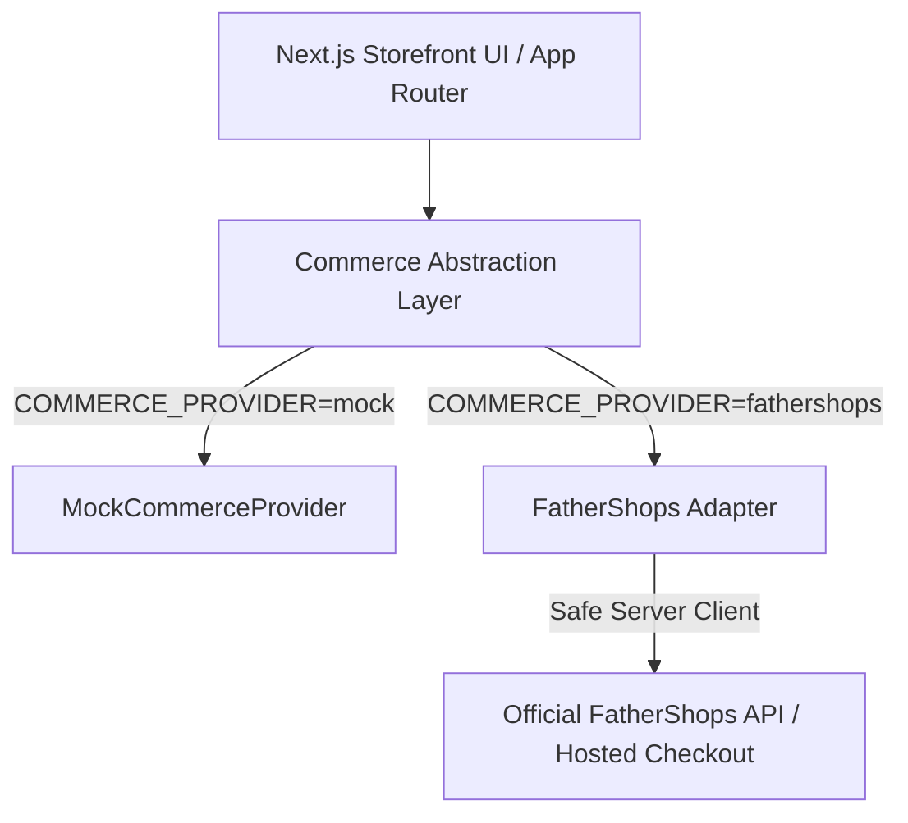

# Universal Commerce API Integration Architecture

## 1. Overview
The COSMELIA storefront uses a strict **decoupled commerce architecture**. The UI layer interacts exclusively with the generic `CommerceProvider` contract, ensuring that the application never depends directly on any specific vendor backend.



---

## 2. Capability Matrix

| Feature | Support Status | FatherShops Implementation Note |
|---|---|---|
| **Product Catalog** | Verified / Adapter | Mapped via `mapFatherShopsProductToProduct()` from FatherShops products endpoint. |
| **Categories** | Verified / Adapter | Mapped via `mapFatherShopsCategoryToCategory()` from FatherShops categories endpoint. |
| **Cart Storage** | Verified / Hybrid | Client-side persistent cart with transparent sync to FatherShops sessions where supported. |
| **Checkout** | Hosted Redirect / Adapter | Redirects to `FATHERSHOPS_CHECKOUT_URL` with cart ID token or initiates adapter handoff. |
| **Customer Auth** | Adapter Ready | Isolated customer interface for order tracking and address books. |
| **Order History** | Adapter Ready | Read-only manifesto order retrieval. |

---

## 3. Environment Configuration
To switch between mock development and production FatherShops connection:

```env
# Switch provider
COMMERCE_PROVIDER=fathershops

# FatherShops Credentials
FATHERSHOPS_API_URL=https://api.fathershops.com/v1
FATHERSHOPS_API_KEY=your_verified_api_key
FATHERSHOPS_STORE_ID=your_store_id
FATHERSHOPS_CHECKOUT_URL=https://yourstore.fathershops.com/checkout
```

---

## 4. Code Isolation Rules
1. **No UI components** may import from `@/lib/fathershops`.
2. All components must import `getCommerceProvider()` from `@/lib/commerce`.
3. If an endpoint is unverified or unavailable, the adapter returns a clean fallback without crashing or faking fake endpoints.
